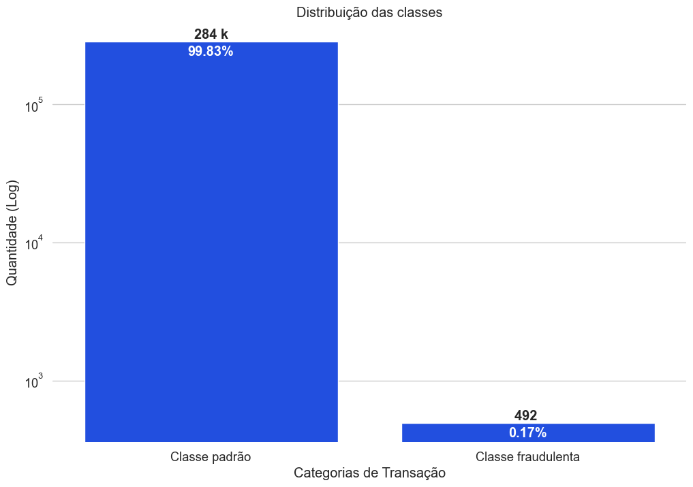
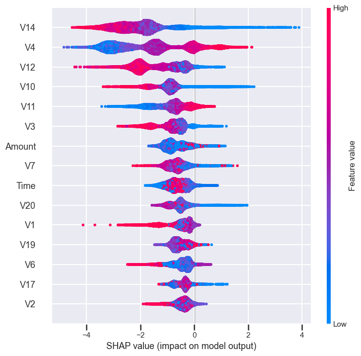
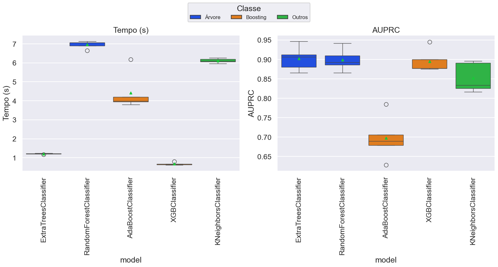
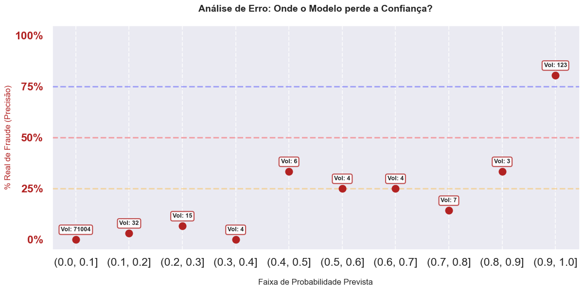
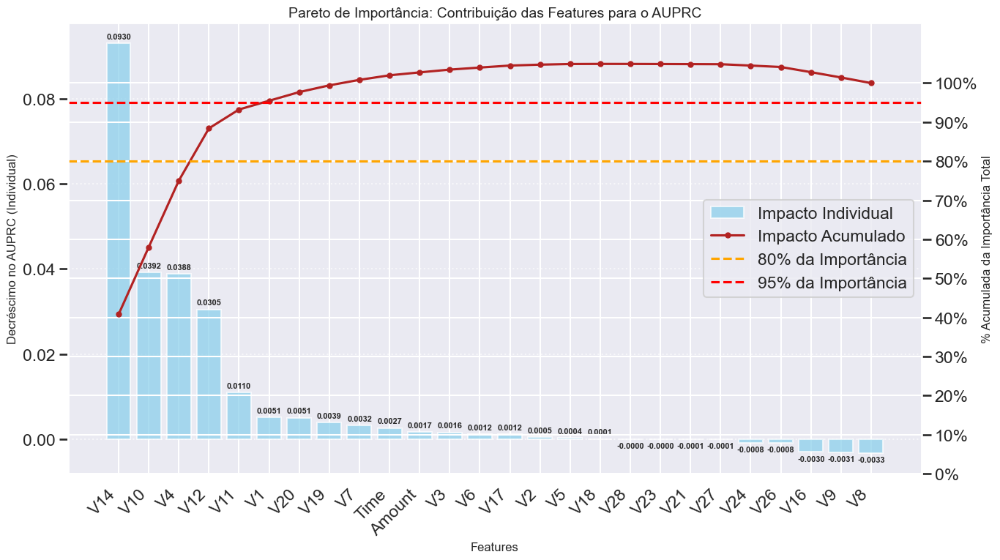
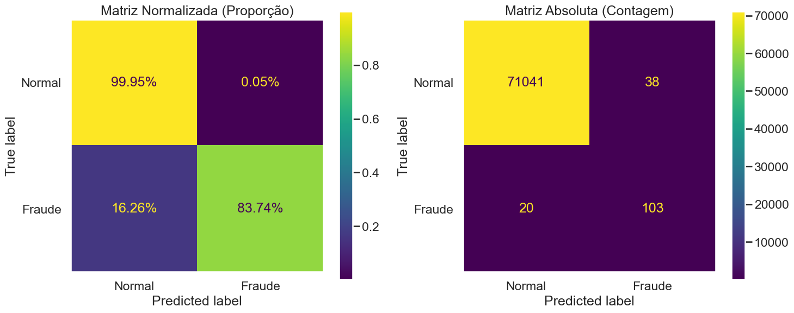

# Estudo de classificação em bases desbalanceadas e com _outliers_ extremos.



# Sobre a base de dados

Essa é uma base de dados do [Kaggle](https://www.kaggle.com/mlg-ulb/creditcardfraud) que registrou movimentações de cartões de crédito fraudulentas. As transções ocorreram em Setembro de ``2013`` por titulares de cartão de crédito europeus. Os registros são de dois dias com ``492`` fraudes de ``287.807`` transações.

Por questões de **confidencialidade**, não são disponibilizadas as identificações de boa parte das variáveis originais.

As colunas foram representadas como **V1, V2,... V28**  e são resultado de uma transformação de análise de componentes principais - ``PCA``, uma técnica utilizada para condensar a informação contida em várias variáveis originais em um conjunto menor de variáveis estatísticas (componentes) com uma **perda mínima de informação**. 

# Objetivo do projeto

Nosso primeiro objetivo é **criar um modelo de _Machile Learning_** robusto para lidar com os dados disponibilizados e simples o suficiente para ser implementado em produção se fosse o caso. 

Nosso segundo objetivo é **explorar e discutir**  métodos alternativos de limpeza de _outliers_ e os impactos da **base extremamente desbalanceada** (0.172% da classe alvo) com **alta proporção de _outliers_** em EDA's (_Exploratory Data Analysis_) e criação de modelos de classificação; bem como se é possível **manipular e verificar os resultados** de forma racional para promover o maior nível de g**eneralização dos modelos testados**, em especial, o mais promissor em contextos reais.

**Figura:** Gráfico de SHAP Values do modelo escolhido com dados reservados para teste.



## Organização do projeto

```
├── .env               <- Arquivo de variáveis de ambiente 
├── .gitignore         <- Arquivos e diretórios a serem ignorados pelo Git
├── ambiente.yml       <- O arquivo de requisitos para reproduzir o ambiente de análise
├── LICENSE            <- Licença de código aberto 
├── README.md          <- README principal para desenvolvedores que usam este projeto.
|
├── dados              <- Arquivos de dados para o projeto.
|
├── modelos            <- Modelos treinados e serializados, previsões de modelos ou resumos de modelos
|
├── notebooks          <- Cadernos Jupyter. 
│
|   └──src             <- Código-fonte para uso neste projeto.
|      │
|      ├── __init__.py  <- Torna um módulo Python
|      ├── auxiliares.py<- Funções auxiliares básicas do projeto
|      ├── config.py    <- Configurações básicas do projeto
|      ├── models.py    <- Funções para EDA
|      └── graficos.py  <- Scripts para criar visualizações exploratórias e orientadas a resultados
|
├── referencias        <- Dicionários de dados, manuais e todos os outros materiais explicativos.
|
├── relatorios         <- Análises geradas em HTML, PDF, LaTeX, etc.
│   └── imagens        <- Gráficos e figuras gerados para serem usados em relatórios
```

## Configuração do ambiente

1. Faça o clone do repositório que será criado a partir deste modelo.

    ```bash
    git clone 
    ```

2. importe o ambiente virtual semelhante ao utilizado.

    a. Caso esteja utilizando o `conda`, use as dependências do ambiente para o arquivo `ambiente.yml`:

      ```bash
      conda env create -f ambiente.yml
      ```

    b. Caso esteja utilizando outro gerenciador de ambientes, exporte as dependências
    para o arquivo `requirements.txt` ou outro formato de sua preferência. Adicione o
    arquivo ao controle de versão, removendo o arquivo `ambiente.yml`.


# Resultados

**- Sobre modelos:**

1. O ``XGBoost`` é a escolha mais robusta para este cenário de fraude. Ao contrário do ``AdaBoost``, que é "sequestrado" por _outliers_ devido ao seu foco obsessivo em pesos, ou do ``LGBM``, que pode perder generalização em desbalanceamentos extremos, o ``XGBoost`` utiliza gradientes e regularização $L2$ para tratar as anomalias de forma sofisticada. Em termos operacionais, ele provou ser **duas vezes mais rápido que o ``ExtraTrees``** para treinamento e previsão, oferecendo o melhor compromisso entre custo computacional e performance.




2. O modelo demonstrou ser ``extremamente confiável`` tanto na base **limpa** quanto na base **crua**, apresentando uma progressão ``monotônica`` ideal. Isso significa que, à medida que a probabilidade prevista pelo modelo aumenta, **a taxa real de fraude também sobe**, caracterizando um **classificador bem calibrado**. 




3. Houve uma redução drástica de complexidade, passando de ``30 features originais para apenas 15`` com impacto mínimo nas métricas de ``AUPRC``. 





4. Existe certa **resistência aos hiperparâmetros** que podemos explicar com os três pontos acima: Em problemas com desbalanceamento severo e _features_ latentes fortes, a engenharia de dados e a seleção de features impactam mais o resultado do que a busca exaustiva por hiperparâmetros. A redução de ``30`` para ``15`` _features_ sem perda de performance (``AUPRC`` constante) é a prova cabal dessa saturação.


**- Sobre a base**

5. A análise comparativa entre **diferentes proporções** de base serviu como um alerta crítico para o _overfitting_. Em bases muito reduzidas ou desbalanceadas artificialmente, os modelos tendem a encontrar "padrões" pouco aderentes à realidade, **perdendo a capacidade de generalização**. A oscilação nas métricas durante a validação cruzada em amostras pequenas **reforçou que qualquer erro de amostragem pode distorcer a confiança do modelo**, exigindo cautela na interpretação de melhorias "milagrosas" em subsets menores.

**- Sobre o negócio**

6. O diagnóstico por faixa de volume definiu a estratégia de negócio: o **``threshold`` ótimo de ``0,89``** na base reservada garante que **bloqueios automáticos acima de ``0,80``** tenham chance de erro quase nula. O modelo é **excelente em identificar o que é legítimo** (concentrando 71.004 casos na faixa de probabilidade zero), mas admite um limite físico nos dados: o Recall de ``~80%`` indica que cerca de **20% das fraudes** são tão parecidas com transações normais que recebem scores baixíssimos, tornando-se "invisíveis" (Falsos Negativos) sem a adição de novas camadas de informação. Logo, a faixa ``0,4 e 0,89`` deve ser considerada com atenção pela equipe de análise, pois é a zona obscura do modelo.




## Notebooks de referência

Análise Exploratória dos dados e discussão inicial: [EDA](notebooks/01_EDA_Mult_Var.ipynb).<br>
Criação do modelo e discussão do projeto: [Modelo Principal](notebooks/02_Modelos_Mult_Var.ipynb).

# Crétidos
## Modelo de projeto de ciência de dados

Desenvolvido por [Francisco Bustamante](https://github.com/chicolucio), para alunos iniciantes em ciência de dados de meus cursos e mentorias.

## Projeto

Adaptado do projeto desenvolvido no curso "Ciência de Dados Impressionadora" da Hashtag Treinamentos pelo professor [Francisco Bustamante](https://github.com/chicolucio)